# learning-jenkins
# JENKINS

## INDEX

1. [INTRODUCTION](#INTRODUCTION)
2. [INSTALLATION WITH DOCKER](#INSTALLATION-WITH-DOCKER)
3. [ADMINISTRATION](#ADMINISTRATION)
4. [Manage Jenkins](#Manage-Jenkins)
    - [Options](#Options)
3. [JOBS](#JOBS)
    - [EXAMPLE FOR A GIT HUB NODEJS REPOSITY ](#EXAMPLE-FOR-A-GIT-HUB-NODEJS-REPOSITY)
3. [SOME TROUBLES SOLVED](#SOME-TROUBLES-SOLVED)

## INTRODUCTION
Open source software and on-premise, its wrote on Java, used to automate and deploy software porjectes on a continuos basis but also you can automate software to execute specific task, for instance you could automate a software to send messages to someone.

- Other Jenkins' characteristics is that is extensible then you can make plugins even use plugins made by third person
- Allow vertical and horizontal (slave servers) scaling
- Pipeline as code which mean that you can write/script your automations making the job easier


## INSTALLATION WITH DOCKER

- install docker

    #docker pull jenkins #failed
    docker pull jenkins/jenkins
    #run container
    docker run -d --name jenkins -p 5002:8080 jenkins/jenkins
    #runt container with volume
    docker run -d --name jenkins -p 5002:8080 -v /Users/peter/Desktop/Projects/learning-jenkins/volumes:/var/jenkins_home jenkins/jenkins
    #enter to the container
    docker exec -it jenkins bash
    #check the password and copy
    cat /var/jenkins_home/secrets/initialAdminPassword
    #go to localhost:jenkins-container-port and paste de password
    #install default 
    #add data
    #username: admin
    #password: admin
    #full name: administrator
    #email:
    #access through http://localhost:5002/
    #Also you can use a docker-compose
    ```yml
    version: '3'

    services:
    jenkins:
        image: jenkins/jenkins:lts-jdk17
        container_name: jenkins
        restart: always
        ports:
        # jenkins default port
        - "8080:8080"
        # this port is used to connect Jenkins agents, specially used on master.slave mode to distribute the work charge
        - "50000:50000"
        volumes:
        - jenkins_home:/var/jenkins_home

    volumes:
    jenkins_home:

    #Running
    #docker pull jenkins/jenkins:lts-jdk17
    #docker-compose up -d
    #docker run -it --name jenkins_jenkins_home --rm -v jenkins_jenkins_home:/ruta/dentro/contenedor alpine sh
    ```

## ADMINISTRATION

set permissions so that specific users admin Jenkins

## Manage Jenkins

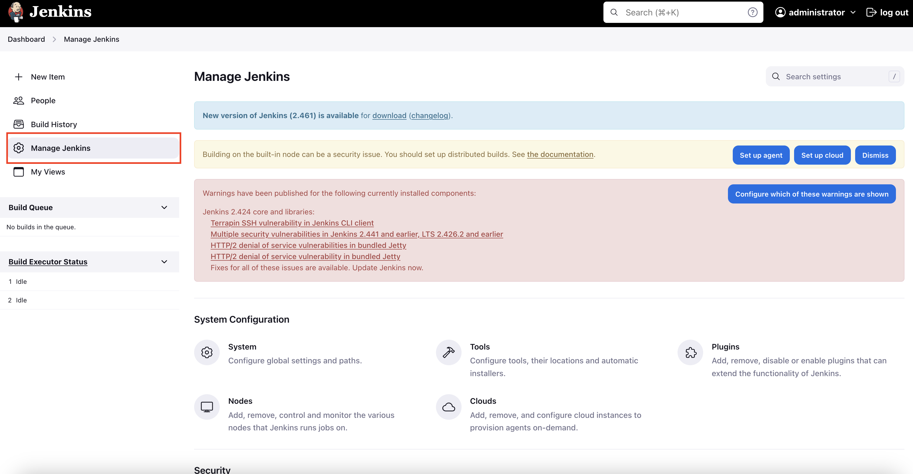

### Options

- System configuration

    - here you can add, modify, and delete global variables and paths generally

- Tools and Plugins

    - tools/plugins installed on Jenkins, you can install more
    - Jenkins can use the tools that you have installed on the server, it is recommended to use the tools from the Jenkins' plugins 
    - to install plugins you must go to Manage Jenkins/plugins 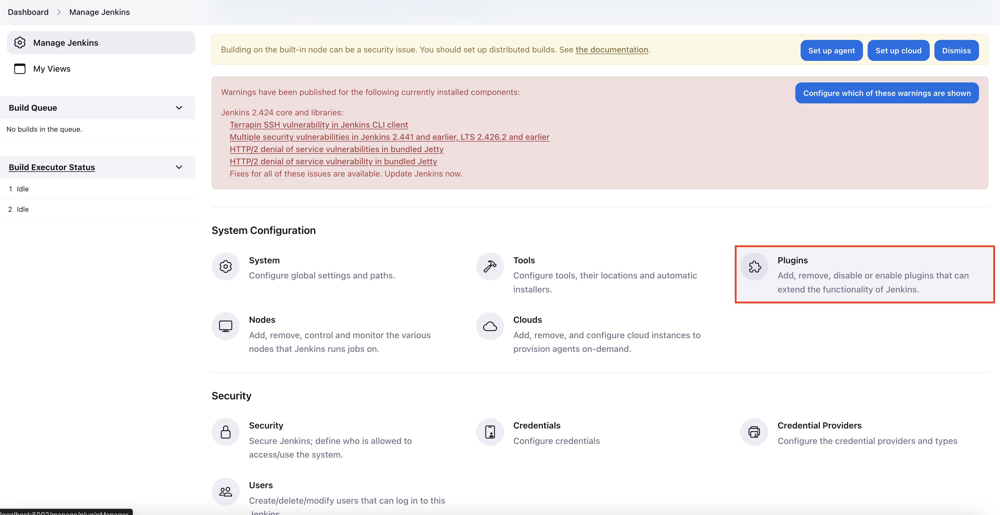
        - to install go to Avaliable plugins 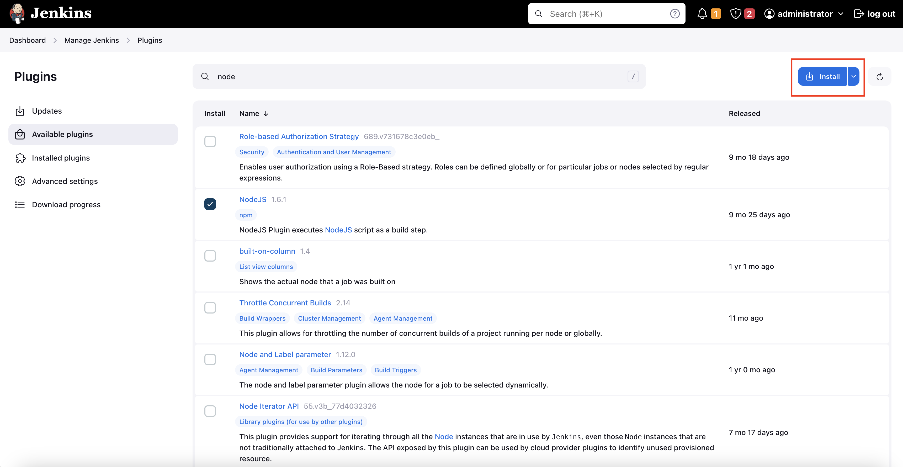

- Nodes and Clouds

    When you have a lot process yoy might need computing power (vertical scaling) but sometimes this could be unprofitable the Nodes and cloud are used to scale horizontally using other servers which are configure in these options

- Credentials

    Set the passwords for differents tools such as gitlab, github, etc. The credentials are used on system configuration

- Users

    Going to Manage Jenkins/Users you can admin users (create, modify, delete) but here only set the general information, but to modify the permissions you have to set these on Manage Jenkins/Security

- Security 

    In security module you can set the Authentication and Authorization options 


## JOBS

used to automate tasks

- Free style job 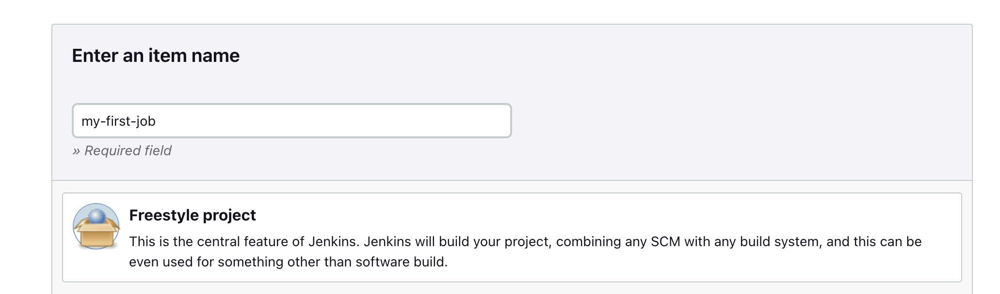

    once the job has been created since configuration you have many options among which are:

    ### EXAMPLE FOR A GIT HUB NODEJS REPOSITY 

    NOTE: the options may vary according to the installed plugins

    - General: add general info of the job, also has a switch to turn on/off the job, another important option is `execute concurrent builds if necessary` 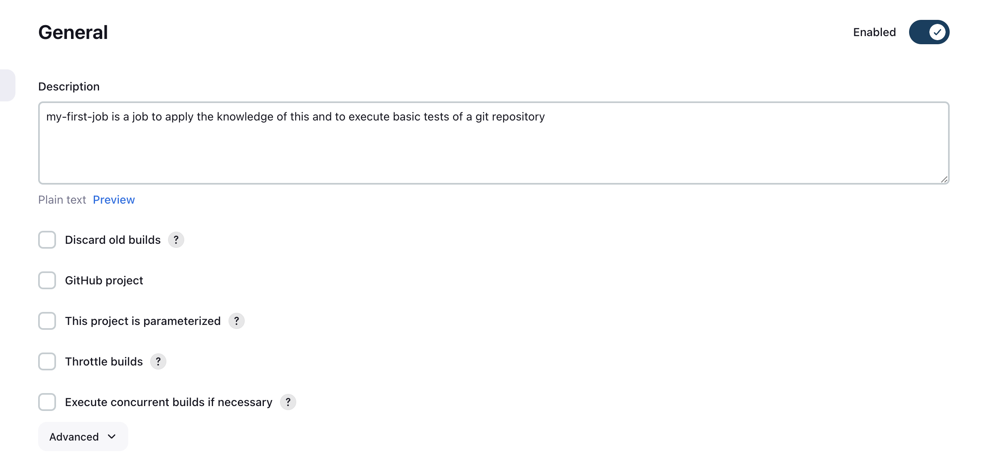
    - Source Code Management (SMC): here you can config the repository in the example is the config for a github repository and on section `Branches to build` you can specify the branch if you want to that job run for all branches you should set "**" (without quotation marks). You can add many repositories for a single job 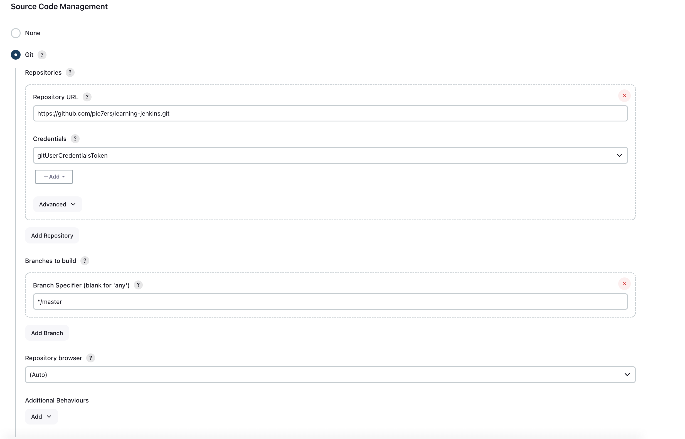
    - Build Trigger: In this section you determine when the job is executed:
        - Trigger builds remotely (e.g., from scripts): run the job through an HTTP call
        - Build after other projects are built: run the job after another job is executed
        - Build periodically: schedule the job to run at regular intervals using a cron
        - GitHub hook trigger for GITScm polling 🟢: run the job when Git notifies Genkins about a change in the repository. Also is necessary that you configure webhooks in your repository, in PayloadURL "http://your-jenkins-url/github-webhook/" 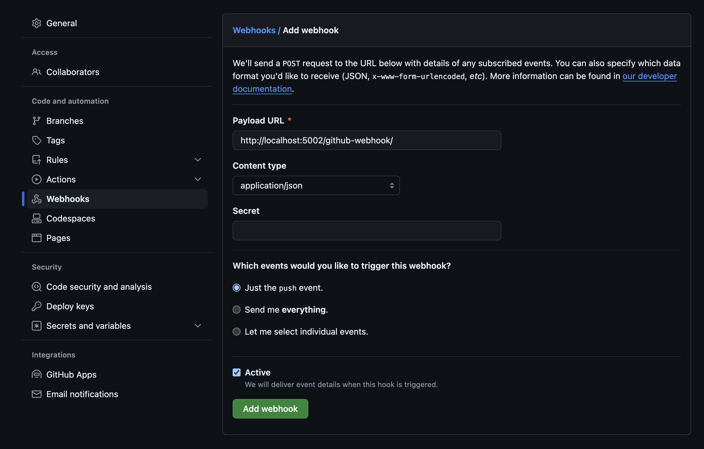
        - Poll SCM: Jenkins will check the SCM for changes at regular intervals and run the job if there are changes
    - Build Environment: configure the environment where the job will be executed 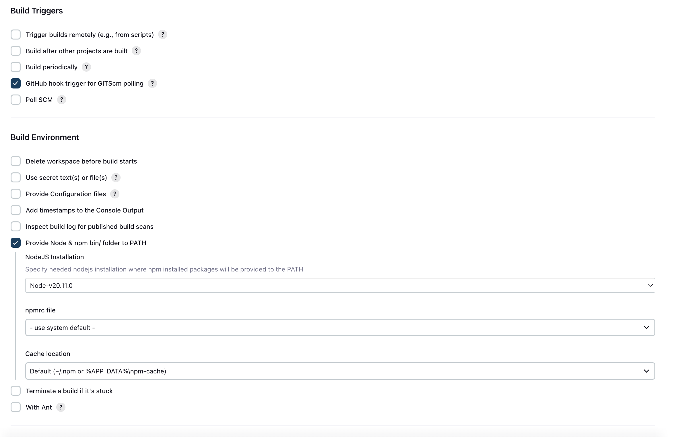
        - Delete workspace before build starts: clear the workspace before starting the build 
        - Use secret text(s) or file(s): use texts or secret files
        - Provide Configuration files: add configuration files previously added "manage jenkins/managed files" configuration files option
        - Add timestamps to the Console Output:
        - Inspect build log for published build scans:
        - Provide Node & npm bin/ folder to PATH 🟢: add the paths to Node.js and npm PATH for this is necessary have installed the NodeJS plugin and from "manage jenkins/tools" configure an specific version to be enable in the job otherwise job use a default version 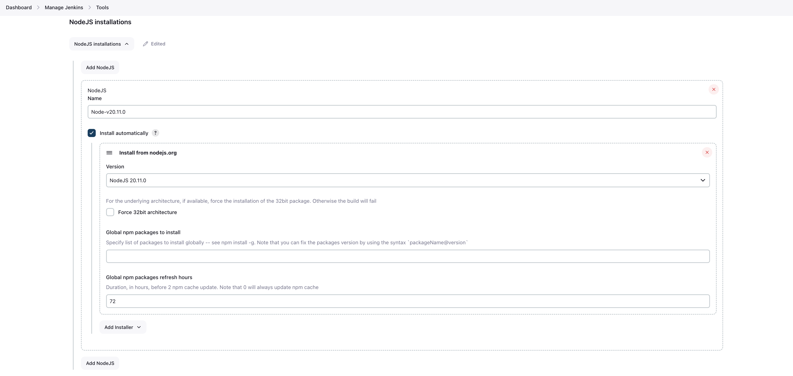
        - Terminate a build if it's stuck: like its name says will finish the build if it's stuck
        - With Ant: Prepares an environment for Jenkins to run builds using Apache Ant. Annotates Ant-specific output to display executed targets. Optionally sets up an Ant and/or JDK installation.
    - Build Steps: determine the steps to execute during the build 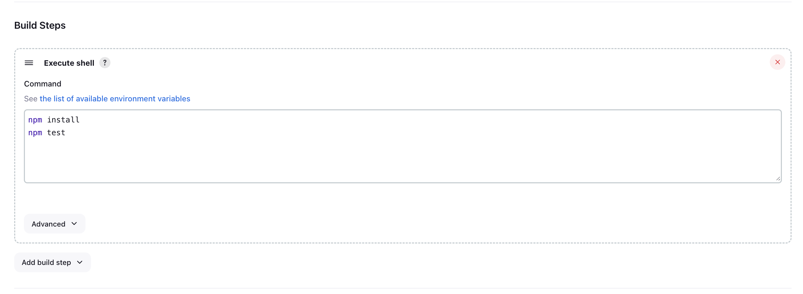
        - Execute Shell: run shell commands on Unix environment.
        - Execute Windows batch command: run Windows batch commads.
        - Invoke Ant: run Apache Ant jobs.
        - Invoke Gradle Script: run Gradle jobs.
        - Run with timeout: run the build with a limit time.
        - Invoke top-level Maven targets: run Maven jobs.
        - Execute SonarQube Scanner: run SonarsQube Analysis.
    - Post Build Actions: set actions to run after the build 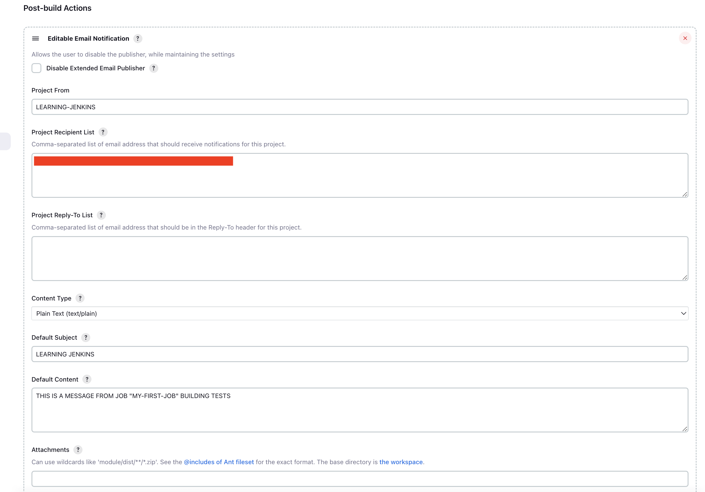
        - Archive the artifacts: save the artifacts generated by the build (tests files, config files, reports, etc)
        - Publish JUnit test result report: publis the JUnit result tests
        - Email Notification: send emails
        - Build other projects: run other jobs
        - Record fingerprints of files to track usage: track files through finger prints
        - Deploy artifacts to servers:


## SOME TROUBLES SOLVED

for node projects in case that you have many registries and the job generates errors check the package-log.json and verify if the registry that produces the error is mention and remove all its references if you don't need it

## EXPOSE PORTS FOR LOCAL TESTS
- pnpm install -g localtunnel
    - localtunnel exposes your localhost to the world for easy testing and sharing! No need to mess with DNS or deploy just to have others test out your changes.
    - lt --port 8080

## pnpm
```shell
#npm ci
pnpm install --frozen-lockfile
```