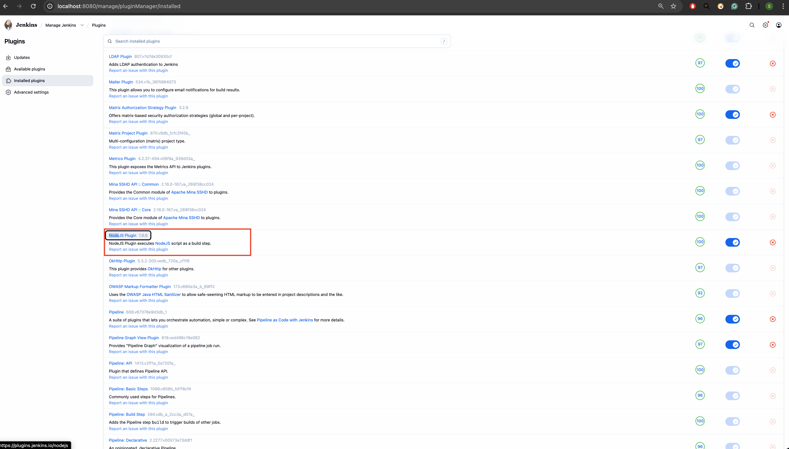
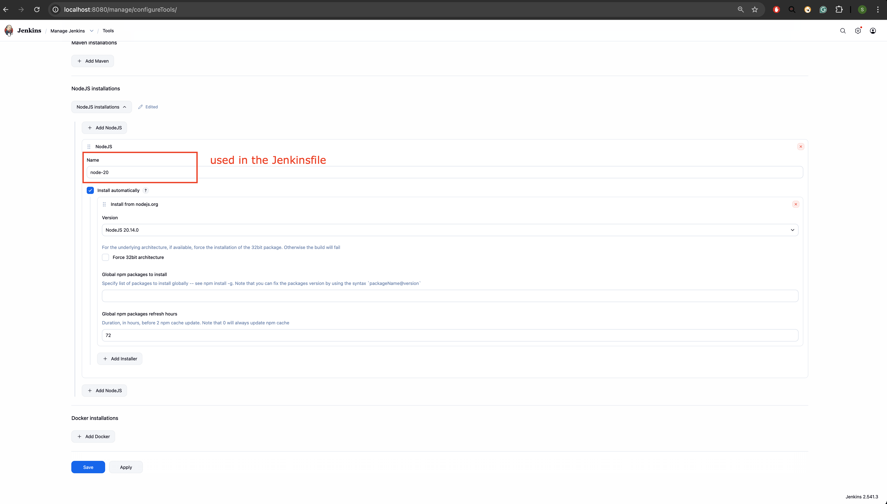
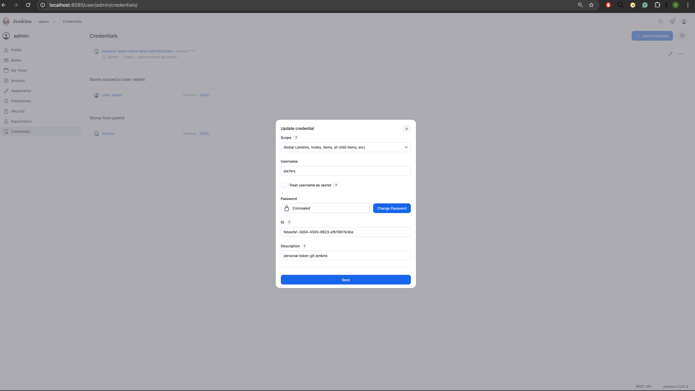
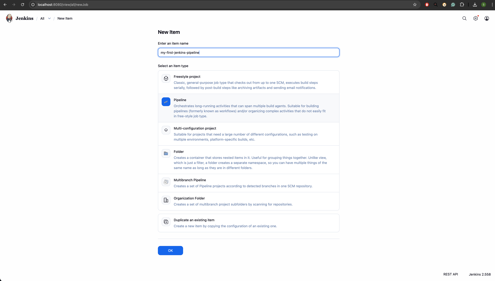
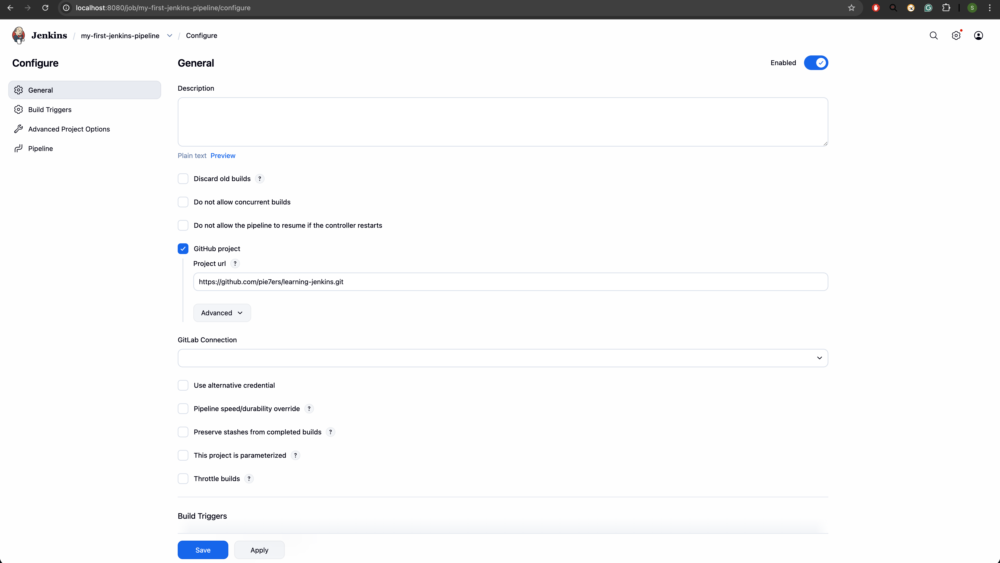
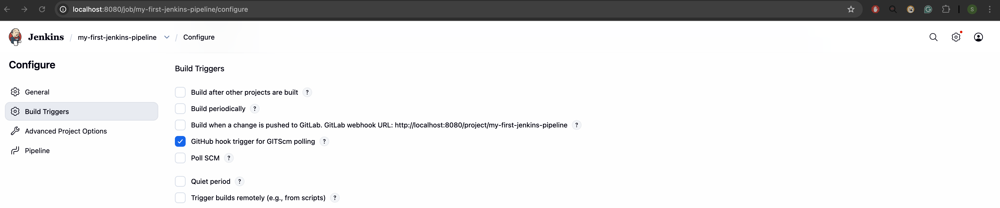
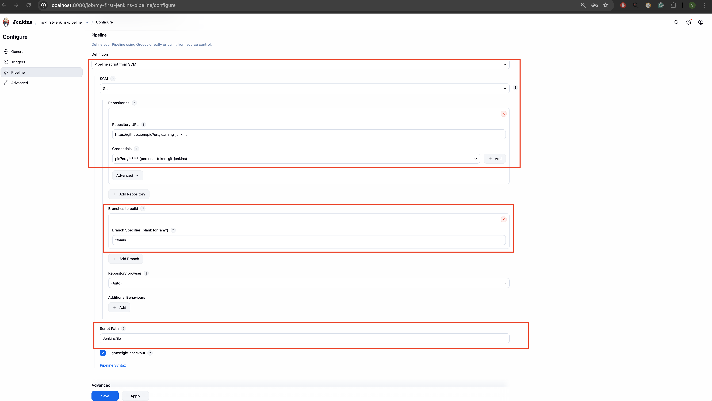
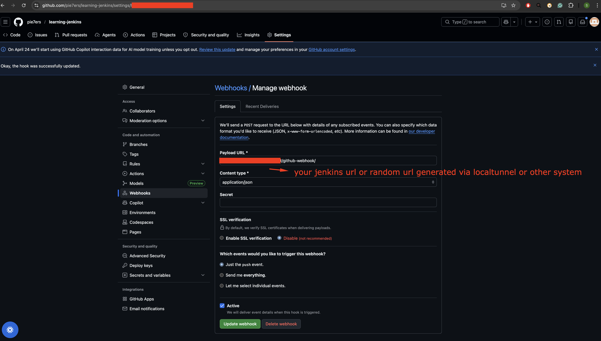

# learning-jenkins
# JENKINS

## INDEX

1. [INTRODUCTION](#INTRODUCTION)
2. [INSTALLATION WITH DOCKER](#INSTALLATION-WITH-DOCKER)
3. [ADMINISTRATION](#ADMINISTRATION)
4. [Manage Jenkins](#Manage-Jenkins)
    - [Options](#Options)
3. [JOBS](#JOBS)
    - [EXAMPLE FOR A GIT HUB NODEJS REPOSITY ](#EXAMPLE-FOR-A-GIT-HUB-NODEJS-REPOSITY)
3. [SOME TROUBLES SOLVED](#SOME-TROUBLES-SOLVED)

## INTRODUCTION
Open source software and on-premise, its wrote on Java, used to automate and deploy software porjectes on a continuos basis but also you can automate software to execute specific task, for instance you could automate a software to send messages to someone.

- Other Jenkins' characteristics is that is extensible then you can make plugins even use plugins made by third person
- Allow vertical and horizontal (slave servers) scaling
- Pipeline as code which mean that you can write/script your automations making the job easier


## INSTALLATION WITH DOCKER


### OPTION 1: DOCKER COMPOSE

- It'll use [docker-compose.yml](docker-compose.yml)

    ```shell
    # Running
    #   docker pull jenkins/jenkins
    #   docker compose up -d
    #   docker compose -f docker-compose.yml up -d
    # enter to the container
    #   docker exec -it jenkins bash
    # check to get the password and copy
    #   cat /var/jenkins_home/secrets/initialAdminPassword
    ```

### OPTION 2: MANUAL

    ```shell
    # docker pull jenkins # failed
    docker pull jenkins/jenkins
    # run container
    docker run -d --name jenkins -p 5002:8080 jenkins/jenkins
    # runt container with volume
    docker run -d --name jenkins -p 5002:8080 -v /Users/peter/Desktop/Projects/learning-jenkins/volumes:/var/jenkins_home jenkins/jenkins
    # enter to the container
    docker exec -it jenkins bash
    # check the password and copy
    cat /var/jenkins_home/secrets/initialAdminPassword
    # go to localhost:jenkins-container-port and paste de password
    # install default 
    # add data
    # username: admin
    # password: admin
    # full name: administrator
    # email:
    # access through http://localhost:5002/
    ```

## SETTING UP JENKINS

- Go to jenkins enter the admin password getting from the container:
    - enter to the container
        - docker exec -it jenkins bash
    - check the password and copy
        - cat /var/jenkins_home/secrets/initialAdminPassword

- Go to plugins host/manage/pluginManager/available
    - install plugins such as NodeJS
    

- Go to plugins host/manage/configureTools/
    - config node tool
    

> [!NOTE]
> name corresponds to the reference used in the jenkinsfile

### Jenkins Credentials

- Set up credentials
    - for the example the credential is a [personal access token](https://github.com/settings/personal-access-tokens)
    
    

## ADD JENKINSFILE

- add Jenkinsfile to the repository e.g: [Jenkinsfile](Jenkinsfile)

## PIPELINES

- Add a new item of Pipeline type


- In general secciton:
    - Check Github project and set the url project


- In build triggers:
    - for this step you need to set up github webhook [SETTING UP GITHUB WEBWOOK](#setting-up-github-webwook)
    - check GitHub hook trigger for GITScm polling 


- In pipeline section:
    - Select `Pipeline script from SCM`
    - SCM = GIT
    - add your repository url
    - in credentials select your credential or add a new one. Take a look in [Jenkins Credentials](#jenkins-credentials)

- Save

## SETTING UP GITHUB WEBWOOK

https://github.com/GITHUB-USER/REPOSITORY/settings/hooks/HOOK-ID e.g: 

- to add the payload url you can have some options:
    - using tools as [localtunnel](#expose-ports-for-local-tests), ngrok, etc
    - cloudflare steps:
        - brew install cloudflare/cloudflare/cloudflared
        - cloudflared tunnel --url http://localhost:8080
        - copy the url provided by cloudflared and add /github-webhook/ at the end
            - e.g: https://surprised-recipes-threshold-smith.trycloudflare.com/github-webhook/
        - e.g: https://wicked-berries-jam.loca.lt/github-webhook/
    "http://your-jenkins-url/github-webhook/" 
    - Poll SCM: Jenkins will check the SCM for changes at regular intervals and run the job if there are changes
    


## EXPOSE PORTS FOR LOCAL TESTS
- pnpm add -g localtunnel
    - localtunnel exposes your localhost to the world for easy testing and sharing! No need to mess with DNS or deploy just to have others test out your changes.
    - lt --port 8080

> [!NOTE]
> remember the url provided by localtunnel or anotehr tool, it must be running to expose your localhost and set in the github webhook.

## pnpm
```shell
npm ci
```